# LIDIA UTS & KUIS SUMMARY WOOOOOOOO

damn im dying, anyways welcome back to another goddamn summary

## Daftar Isi

1. [Pengenalan Literasi Data, Artificial Intelligence](#meet-1-pengenalan-literasi-data-artificial-intelligence)
2. [Konsep Penting Literasi Data](#meet-2-konsep-penting-literasi-data)
3. [EDA](#meet-3-explatory-data-analysis)
4. [EDA: Visualisasi](#meet-4-eda-visualisasi)
5. [Peluang](#meet-5-peluang)
6. [Preparation Data](#meet-6-preparation-data)
7. [Pengantar Data Analytics](#meet-7-pengantar-data-analytics)
8. [Machine Learning](#meet-7-part-2-machine-learning)

## Meet 1 Pengenalan Literasi Data, Artificial Intelligence

ightarrow **Membaca, interpretasi, komunikasikan** data sbg informasi

### Tahapan Penyelesaian Data

CRISP DM  
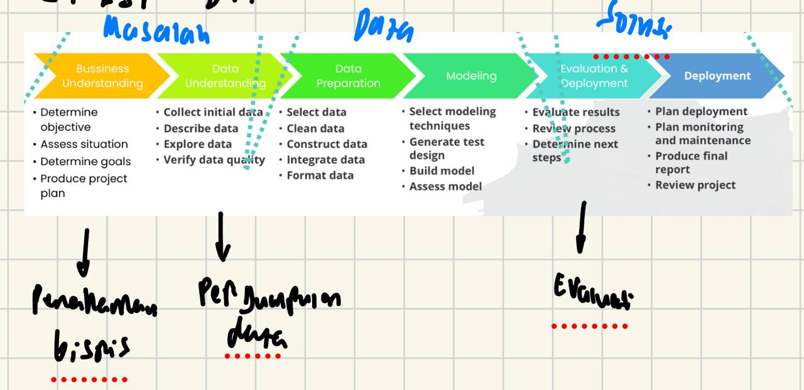

#### Manfaat Kompetensi Literasi Data

- Artikulasi masalah yg berpotensi dpt **diselesaikan dgn data**
- **Memahami sumber** dan _format_ data
- Memastikan **kecukupan dan kesesuaian** data yg digunakan

#### Sumber-sumber Data Digital

- Jejak Digital
  Klik situs web, penggunaan aplikasi, belanja online, interaksi sosmed
- Data Citra dan video
  CCTV recordings
- Rekam medis
  Data pasien seumur hidup
- Data otomotif
  Data pengemudi & perilakunya, data pabrikan

#### Mengapa diperlukan?

- Pelayanan **berkualitas**
- Keputusan **tepat & cepat**
- Keunggulan **kompetitif**
- Prediksi **akurat & optimasi**
- **Manajemen risiko**

### Artificial Intelligence

ightarrow Bidang Ilmu yg **mempelajari/membuat** artefak yg dapat **meniru kecerdasan manusia**

#### Automation vs AI

Automation:

1. Sistem mengerjakan **tugas yg sama**
2. **Tidak** perlu perubahan
3. Meningkatkan **produktivitas**, menurunkan **biaya operasional**, **sederhanakan** alur kerja  
   AI:
4. Sistem mampu **merespon perubahan** informasi scr _dinamis_, memberikan **keputusan** interpretatif
5. Sesuai **task yg relatif kompleks**, memerlukan pembuatan keputusan interpretatif
6. Sama kyk 3 sblmnya, + alur kerja yg **lebih cerdas**, dapat membuat keputusan secara dinamis

#### Intelligent Agents

3 Level:

1. Learning Agent (top)
   Nggak dikasih banyak, determines output from other information
2. Knowledge Based
   Simple logic, finds logic/output by thinking with known facts
3. Problem Solving (bottom)
   Everything gets feed into it

#### Wumpus World

Problem Solving:

ightarrow Gets feed everything (i.e pit locations, gold location, wumpus location)

ightarrow i.e Goal Based/Puzzles (sudoku, maze, N Puzzle), Pathfinding

Knowledge Based:

ightarrow Gets feed sensors (i.e if near a pit via breeze)

ightarrow i.e Expert Systems, Detection Systems

Learning Agent:

ightarrow No information at all

ightarrow Learning from gathering information

ightarrow Reward-punishment system

ightarrow i.e Handwriting detection, Speech recognition, Face recognition

## Meet 2 Konsep Penting Literasi Data

Data
ightarrow Facts/information, especially when examined and need to find out things/make decisions  
Populasi
ightarrow Seluruh **kelompok** (individu/objek) yg ingin diketahui ttgnya  
Pertanyaan penelitian
ightarrow Pertanyaan yg **menyelidiki karakteristik** dari suatu _populasi_

### Pengambilan Keputusan berdasarkan Data

ightarrow Pendekatan **mengedepankan data & analisis** dalam **pengambilan keputusan** suatu penelitian, bisnis, kehidupan sehari-hari

ightarrow Why? **Objektivitas, Keakuratan, Transparansi**

### Menyusun Pertanyaan Penelitian yg baik

Kategori yg kurang baik vs kategori yg baik:

ightarrow Terlalu sempit dan sempit

ightarrow Tidak terfokus dan terfokus

ightarrow Sederhana & Kompleks

### EDA

Proses **sistematis**
ightarrow eksplorasi **kumpulan data & variabel2**, menyusun **statistik ringkasan**, **boxplot**  
Dilakukan **iteratif**
ightarrow menemukan informasi yg **berguna**

Steps:

- Menhasilkan **pertanyaan penelitian**
- Mencari **jawaban** dr pertanyaan dgn **alat visualisasi data** dan **statistika deskriptif**
  ightarrow **Pemodelan data**

Definisi-definisi:

- Variabel
  Atribut yg dapat **diukur/diberi label**
- Data set
  Kumpulan **individual, variabel** yg berasosiasi dgn individu tsb
- Variabel Bebas
  Dipilih utk **diuji pengaruhnya** thdp var terikat
- Variabel Terikat
  Variabel yg **dipengaruhi var bebas**

#### Tipe2 Data:

1. Kategori

- Nominal
  **Tidak** ada _urutan_, i.e tipe material
- Ordinal
  Memiliki **urutan**, tp _bukan_ **quantifiable**, i.e rendah, sedang, tinggi

2. Numerik

- Discrete
  Bil yg \*\*bisa dihitung, i.e jml produk tercatat
- Continuous
  Dapat diambil angka **pada rentang tertentu**, i.e Panjang, tekanan

#### Interval & Rasio

- Interval
  Memiliki **urutan, selisih bermakna, _no_ nol absolut**, i.e Tahun kalender gregorian, temperatur celcius
- Rasio
  Memiliki **urutan, selisih bermakna, nol absolut bermakna**, i.e jml mobil dlm parkiran, jarak

#### Data Tabular

- Menyajikan data dlm **tabel** (wow)
- Baris = **informasi msg2 individu**
- Kolom = **variabel** (atribut)

#### Statistik Deskriptif & Inferensi

- Deskriptif
  **Merangkum & mendeskripsikan** fitur utama kumpulan data  
  Ukuran pemusatan, penyebaran, kemencengan, visualisasi data
- Inferensial
  **Membuat prediksi kesimpulan** berdasarkan sampel data  
  Confidence interval, uji hipotesis, analisis regresi
- Populasi
  Keseluruhan **set elemen/objek** yg diteliti
- Sampel
  Subset dari populasi **yg dipilih utk dianalisis**, mewakiliki _seluruh_ populasi
- Parameter Populasi
  Fakta numerical mengenai suatu populasi

#### Metode Pengumpulan Data

1. Survei

- Tujuan
- Jenis (Kualitatif, kuantitatif)
- Rencana
- Metode Pengambilan Sampel (Sampel probabilitas, nonprobabilitas)
- Uji coba
- Distribusi survei
- Analisis
- Lapor temuan

2. Wawancara

- Persiapan
- Lakukan
- Pascawawancara (Transkripsi, Analisis, Validasi)
- Pertimbangan Etis

3. Observasi
4. Eksperimen

#### Tipe Pertanyaan Riset

1. Estimasi
2. Menguji Klaim
3. Membandingakn subpopulasi/hubungan antara 2 var/lebih dlm populasi

## Meet 3 Explatory Data Analysis

ightarrow Statistika: Ilmu berkaitan cara, Pengumpulan, pengolahan, penyajian, analisis, pencarian kesimpulan data

ightarrow Statistik: Nilai ukuran data yg mudah dimengerti, diperoleh dr observasi, **Pemusatan, penyebaran, kemencengan, kelancipan** data.

ightarrow Data: Berupa Angka/gambar, dikuantifikasi terlebih dahulu, jenis2 data:

1. Kategori

- Ordinal
  ightarrow ada urutan, tdk diketahui jarak (small, medium, large)
- Nominal
  ightarrow tdk ada urutan (tipe bunga)

2. Numerik

- Interval
  ightarrow tdk ada nol absolut (temperatur)
- Rasio
  ightarrow Ada nol absolut (jml mobil)

Ilustrasi Data Nominal

- Warna lukisan per pixel
- Waveform

### Statistik Deskriptif

1. Parameter

- Pemusatan
- Penyebaran
- Kemencengan
- Kelancipan

2. Bentuk

- Simetris/menceng
- Puncak tunggal/jamak

#### Parameter Distribusi

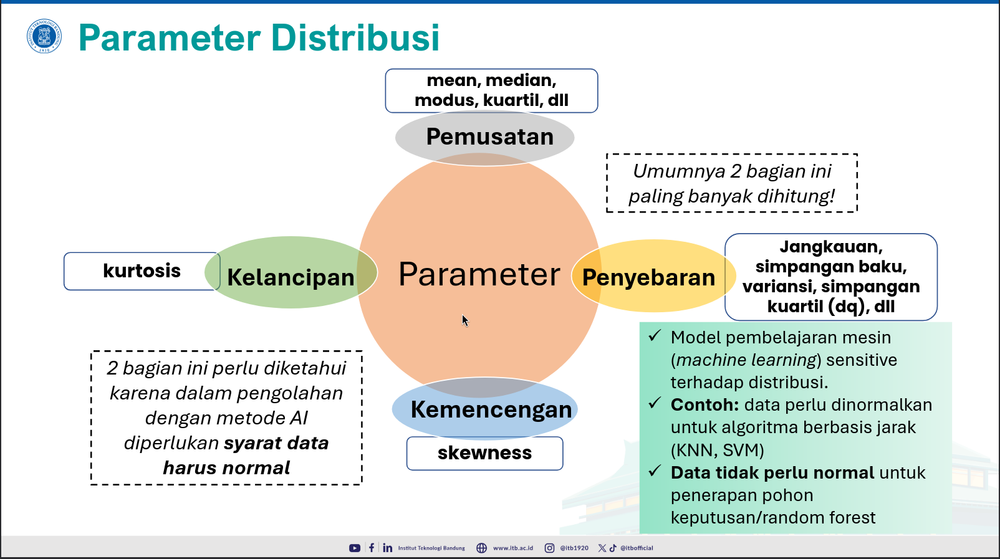

#### Bentuk Distribusi

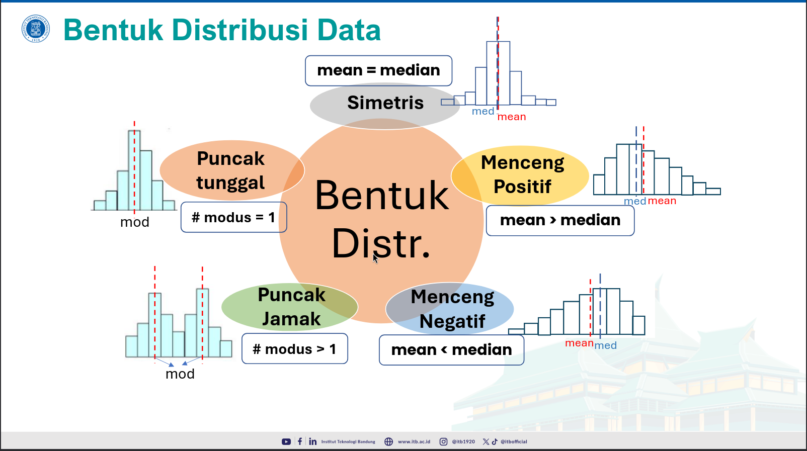

### RUMUS2

now we get to the fun part...

##### Notasi

n datum:
$$o_1, o_2, \dots, o_n$$

n datum (sorted):
$$o_{(1)}, o_{(2)}, \dots, o_{(n)}$$

##### Pemusatan

Mean, Median, Modus, Kuartil, Desil, Persentil, Min, Maks

1. Mean
   $$\bar{o} = \frac{1}{n} \sum_{i=1}^{n} o_i$$
2. Median
   $$q_2 = o_{\left(\frac{n+1}{2}\right)}$$
3. Modus
   Data yg paling banyak muncul
4. Kuartil
   $$q_1 (Bawah) = o_{\left(\frac{n+1}{4}\right)}$$
   $$q_2 (Median) = o_{\left(\frac{n+1}{2}\right)}$$
   $$q_3 (Atas) = o_{\left(\frac{3(n+1)}{4}\right)}$$
5. Desil ke-k
   $$d_k = o_{\left(\frac{k(n+1)}{10}\right)}, k = 1, 2, \dots, 9$$
6. Persentil ke-k
   $$p_k = o_{\left(\frac{k(n+1)}{100}\right)}, k = 1, 2, \dots, 99$$
7. Min, Maks
   $$o_{(1)} = min \text{ dan } o_{(n)} = maks$$

##### Penyebaran

Variansi, Variansi Bias, Simpangan Baku/Standar Deviasi, Range/Jangkauan, Jangkauan Interkuartil, Koefisien variansi

1. Variansi
   $$s^2 = \frac{1}{n-1} \left[ \sum_{i=1}^{n} o_i^2 - \frac{(\sum_{i=1}^{n} o_i)^2}{n} \right] \text{ atau } s^2 = \frac{1}{n-1} \left[ \sum_{i=1}^{n} o_i^2 - n\bar{o}^2 \right]$$
2. Variansi Bias
   $$s_n^2 = \frac{1}{n} \left[ \sum_{i=1}^{n} o_i^2 - \frac{(\sum_{i=1}^{n} o_i)^2}{n} \right]$$
3. Simpangan Baku/Standar Deviasi
   $$s = \sqrt{s^2}$$
4. Range/Jangkauan
   $$J = maks - min = o_{(n)} - o_{(1)}$$
5. Jangkauan Interkuartil
   $$dq = q_3 - q_1$$
6. Koefisien Variansi
   $$CV = \frac{s}{\bar{o}} \times 100\%$$

##### Kemencengan

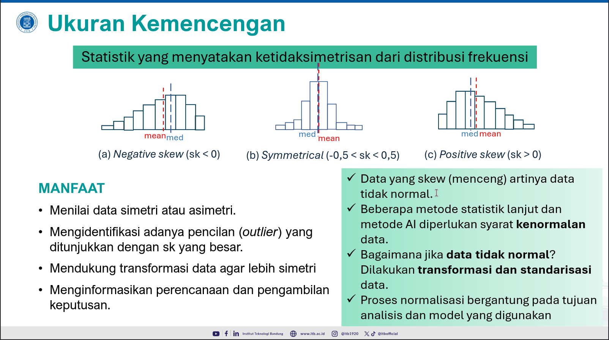

##### Kelancipan

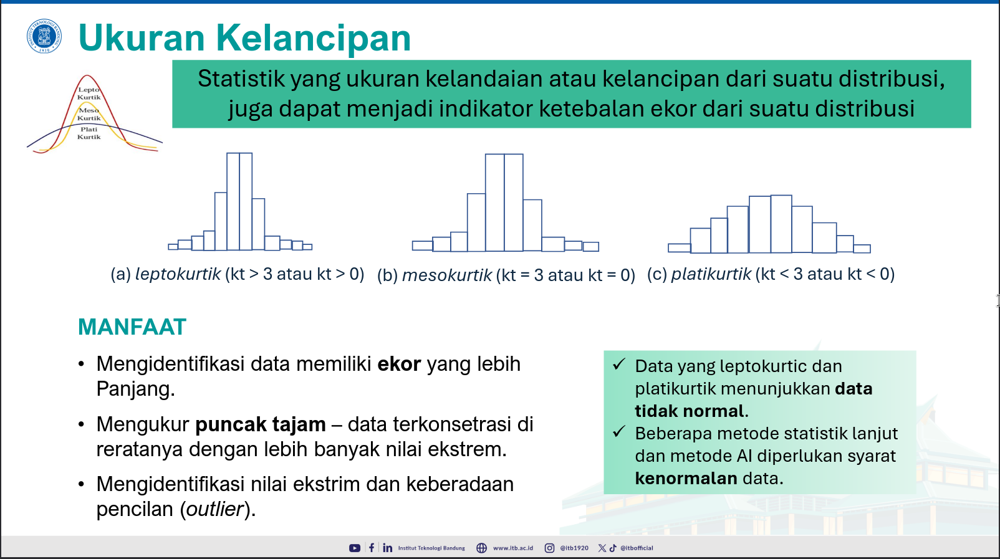

##### Data Pencilan (Outlier)

Langkah2:

1. Jangkauan Interkuartil
   $$dq = q_3 - q_1$$
2. Batas Bawah Pencilan (BBP)
   $$\text{BBP} = q_1 - \frac{3}{2}dq$$
3. Batas Atas Pencilan (BAP)
   $$\text{BAP} = q_3 + \frac{3}{2}dq$$
4. Pencilan Bawah
   $$o_i < \text{BBP}, i = 1, 2, \dots, n$$
5. Pencilan Atas
   $$o_k > \text{BAP}, k = 1, 2, \dots, n$$

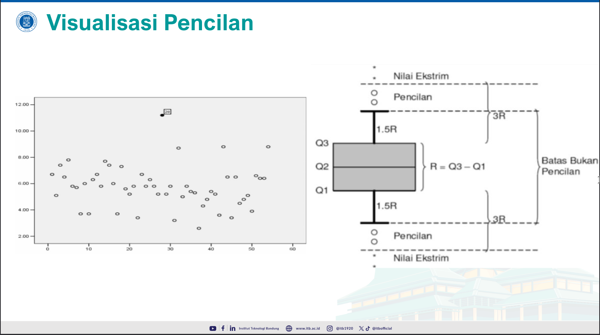

## Meet 4 EDA: Visualisasi

1. Tabel Kontigensi

- Melibatkan **2 variabel kategori/kualitatif**
- Umumnya utk **frekuensi**
- i.e Tipe movil & warnanya
- **Grafik Batang, Pie/Donut Chart**

2. Bar Chart For Multiple Category

- Menggabungkan **data kategori dengan statistiknya**
- i.e nilai dari setiap kategori

3. Histogram

- Visualisasi **distribusi data numerik dlm tiap nilai** (**diskrit**)/**rentang** (\*\*kontinu/diskrit)
- Distribusi data secara **empiris**

4. Boxplot

- Komponen utama: \*\*min, maks, $q_1$, $q_2$, $q_3$, pencilan
- Memberikan informasi **bentuk distribusi serta pencilan**
- Memudahkan perbandingan **antar bentuk distribusi dari beberapa kelompok**

5. Visualisasi Data Deret Waktu

- Membantu melihat **tren**

6. Scatter plot dan korelasi
   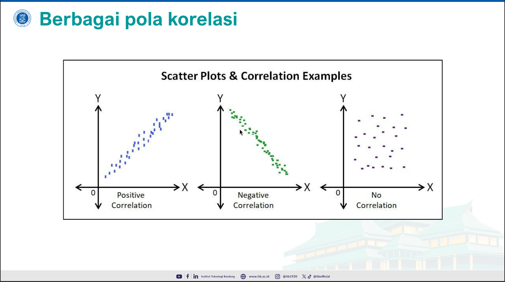

##### Perhitungan Nilai Korelasi

Misal dari pasangan X, Y, dan i,
$$(x_i, y_i), i = 1, 2, \dots, n$$
$$(x_1, y_1), (x_2, y_2), \dots, (x_n, y_n)$$

Perhitungan Nilai Korelasi
$$r = \frac{\sum (x_i - \bar{x})(y_i - \bar{y})}{\sqrt{\sum (x_i - \bar{x})^2 \sum (y_i - \bar{y})^2}}$$

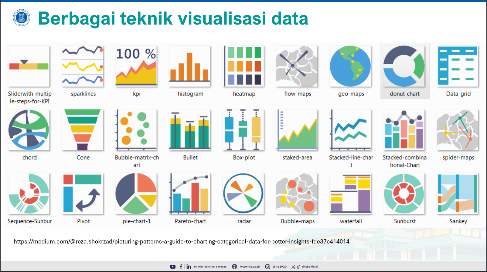  
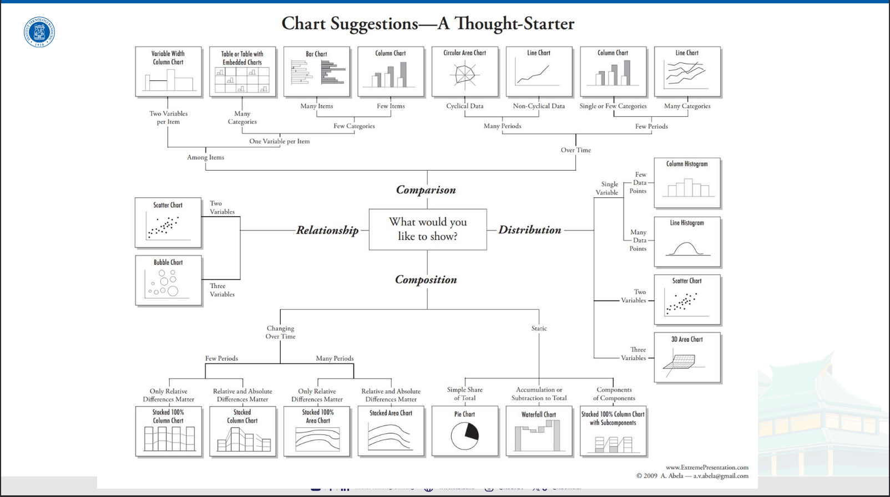

7. Pembuatan Visualisasi Data yg Baik

- Tipe Visualisasi yg **cocok**
- **Rentang skala** yg pas
- **Warna jelas** & intuitif, colorblind friendly
- **Label ringkas**
- Petunjuk tambahan/ **highlight**

## Meet 5 Peluang

1. Ciri2 percobaan acak

- Dapat di**ulangi**
- **Proporsi keberhasilan dapat diketahui**
- **Dapat diukur**
- Hasil _tdk_ bisa **ditebak**

#### More Rumus...

1. Peluang Suatu Kejadian
   $$P(E) = \frac{n(E)}{n(S)}$$
2. Aturan Peluang

- $0 \leq P(E) \leq 1$
- $P(S) = 1$
- Jika, $A, B$ kejadian saling lepas,
  $$
  A \cap B = ∅\\
  P(A \cap B) = 0\\
  P(A \cup B) = P(A) + P(B)
  $$

3. Aturan Aditif

- Jika $A,B$ dua kejadian,
  $$ P(A ∪ B) = P(A) + P(B) - P(A \cap B) $$
- Jika $A, A'$ adalah dua kejadian saling kompelemen,
  $$ P(A) + P(A') = 1 $$

4. Peluang Bersyarat

- Peluang Kejadian yg dibatasi
  $$ P(A | B) = \frac{P(A ∩ B)}{P(B)} $$
// Means that $B$ terjadi sblm $A$
- Jika $A, B$ saling **Bebas**,
  $$
  P(A | B) = P(A)\\
  P(A ∩ B) = P(A)P(B)
  $$
- Jika $A, B$ saling **Lepas**,
  $$
  P(A ∩ B) = 0\\
  A ∩ B = ∅
  $$

5. Aturan Bayes
   Misalkan {$B, B^c$} adalah partisi dari ruang sampel $S$, $A$ adalah kejadian yg terobservasi di $S$,

- Peluang Kejadian $B$ diberikan $A$ adalah:
  $$P(B|A) = \frac{P(A \cap B)}{P(A)} = \frac{P(A|B)P(B)}{P(A|B)P(B) + P(A|B^c)P(B^c)}$$

6. Peubah Acak

- Fungsi yg memetakan **Setiap anggota ruang sampel ke bilangan real**
  $$ X : S → R $$
- Notasi:

1. Peubah acak ditulis harus **Kapital**
2. Realisasi (Nilai peubah acak) ditulis huruf **Nonkapital**

- i.e: Pelemparan Dadu
    
  $$X = \{1, 2, \dots, 6\}$$

- Jenis Peubah Acak

1. Diskrit
   Himpunan terhitung $\{x_1,x_2,\dots\}$, **terhingga/tak terhingga**
2. Kontinu
   Himpunan Nilai-nilai real $(x \in \mathbb{R})$ pada **selang/interval tertentu**

- Konstruksi Peubah Acak

1. Definisikan **ruang sampel** dan **anggotanya**
2. Definisikan suatu **peubah acak** sbg **pemetaan/fungsi** dari ruang sampel → bil. real

## Meet 6 Preparation Data

Topics:

- Data Cleaning
- Missing Values

Siklus PPDAC:

1. Problem
2. Plan
3. Data
4. Analysis
5. Conclusion

ightarrow Fungsi PPDAC: Menggunakan data yg dikumpulkan
ightarrow Meng**analisis** data menggunakan **analisa statistik, algoritma machine learning**

### Data Preparasi

Proses/langkah yg dilakukan utk **mengolah** data _mentah_ menjadi data yg berkualitas dan siap dilakukan **analisis mendalam**  
Key words: Memastikan **kualitas** data, mengurangi **kesalahan** dalam analisis, meningkatkan **interpretasi** hasil

Why?

1. Perlu **penyesuaian format**
2. Data perlu dibuat memadai utk **metode pengolahan tertentu**
3. Data di dunia masih _kotor_
   Kotor:

- Tidak lengkap, i.e tdk ada nilai atribut, atribut, Jenis kelamin = ""
- Noisy, i.e outlier, Umur = '-30'
- Tidak konsisten, i.e perbedaan dalam penulisan kode/nama, peringkat: '1,2,3'
  ightarrow 'A,B,C'

#### Tahapan Data Preparasi

1. Integrasi Data
2. Pengisian Data
3. Pembersihan Data
4. Transformasi Data
5. Reduksi Data
   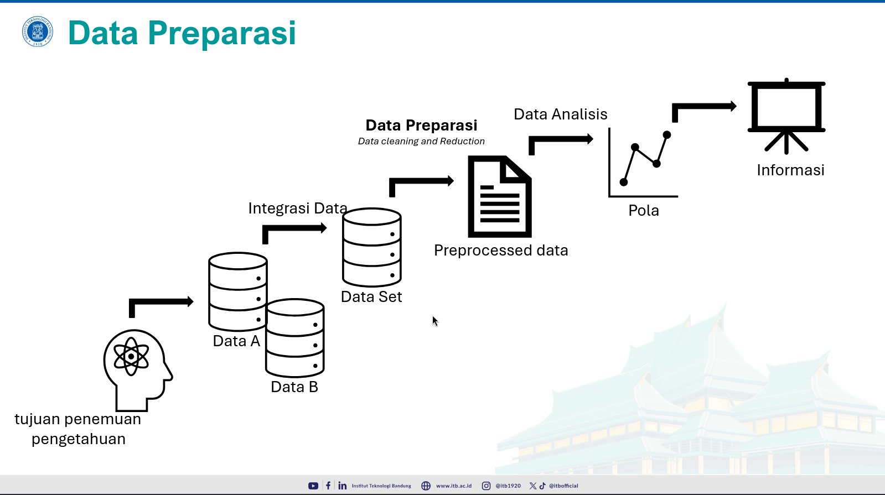

#### Pengukuran

i aint writing ts again, go back [here](#pengukuran)

#### Integrasi & Konversi Data

Data dapat direpresentasikan sbg **kuantitatif** or **kualitatif**

ightarrow Perlunya konversi data **non-numeric**  
i.e  
Skala ordinal
ightarrow Nilai A: 4.0, AB: 3.75, dll  
Atribut kualitatif tdk berurutan
ightarrow Merah (1), Hijau (2), Kuning (3)

#### Data Hilang

Factors for missing data:

- Kerusakan **peralatan**
- Tidak **konsisten** pencatatan dgn data lain
- Data tdk dimasukkan karena **kesalahpahaman** (damn kyk hidup gw)
- Data tertentu tdk dianggap **penting**
- Tdk mencatat **riwayat/perubahan data**

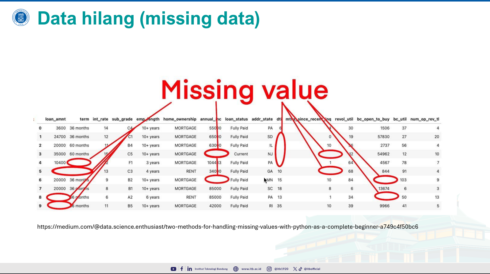

Jenis data hilang:

1. MCAR (Missing Completely At Random)
   Basically random missing data, no correlation with other data
2. MAR (Missing At Random)
   Basically missing data, but could be explained by other variables
3. MNAR (Missing Not At Random)
   Basically missing data that's unexplainable by other data, could be because unobtained data

Handling Missing Data:

- Menghapus **kolom** dgn data hilang
  Deleting an entire column that has **at least** 1 NULL/NaN value
- Menghapus **baris** dgn data hilang
  Deleting an entire row that has **at least** 1 NULL/NaN value
- Mengganti nilai yg hilang dgn **median/mean**
  Very popular, but loses variasi dalam data
- Pengisian kolom **kualitatif**
  Isi dengan kategori yang paling banyak muncul
- Pengisian **maju** (forward fill) or pengisian **mundur** (backward fill)
  Meneruskan nilai **terakhir** yg tdk hilang (forward fill), Meneruskan nilai **berikutnya** yg tdk hilang (backward fill)
  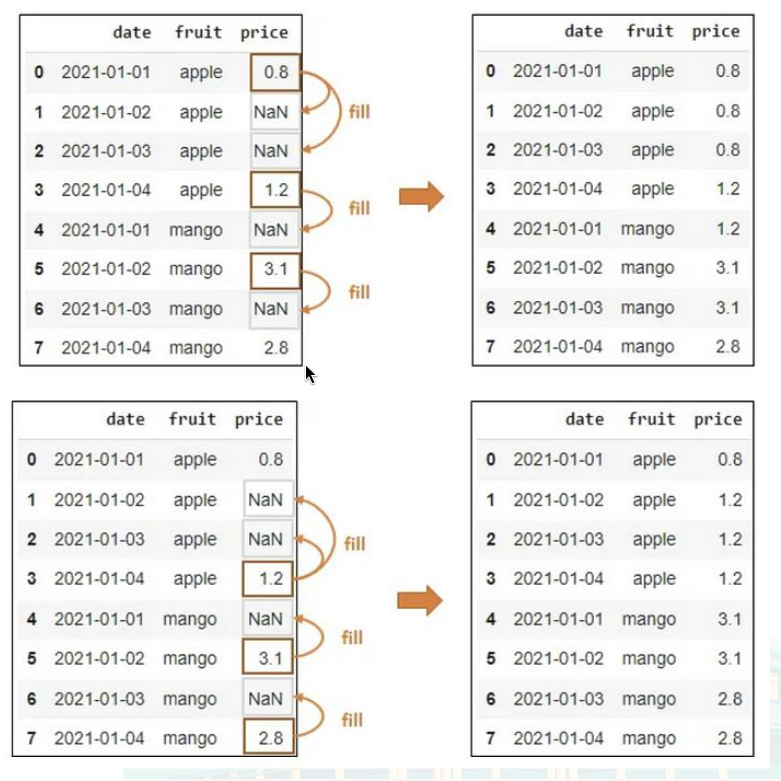
- **Interpolasi**
  Mengisi dengan data yang berdekatan, biasanya dalam data deret waktu yg mengikuti tren tertentu

Rumus Interpolasi linear:  
$$f(x) = f(x_0) + \frac{f(x_1) - f(x_0)}{x_1 - x_0}(x - x_0)$$

Interpolasi Polinomial  
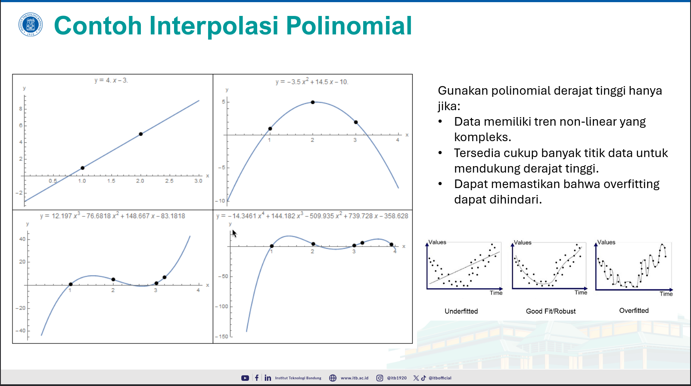

#### Pembersihan Data

ightarrow Agar data terbebas dari **outlier** (nilai yg dianggap berada di luar rentang)  
Here's a [refresher](#outlier)

Jenis Kesalahan Umum:

1. Data inkonsistensi
   Muncul data yg **tidak konsisten** (wow i know) pada kolom yg sama
2. Data Duplikasi
   Bahwa setiap bagian data memiliki 1/lebih duplikat persis pada suatu database

#### Transformasi Data

ightarrow Menggunakan **normalisasi**, penyesuaian nilai2 yg diukur pd skala yg berbeda ke skala yg sama

ightarrow Mencegah data dgn rentang besar memberi bobot lebih besar ketimbang yg kecil

Metode Normalisasi:  
Min-max normalization:  
$$v' = \frac{v - \min_v}{\max_v - \min_v} (new\_max_v - new\_min_v) + new\_min_v$$  
Z-score Normalization:  
$$v' = \frac{v - \bar{v}}{\sigma_v}$$

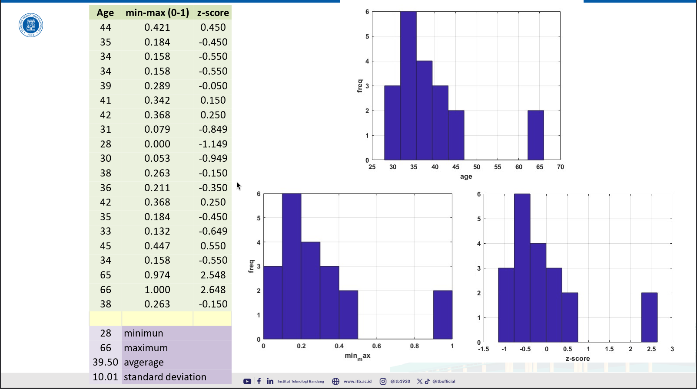

#### Conclusion

ightarrow Setiap kumpulan data memerlukan data preparasi:

- Menangani nilai yg **hilang**
- Memperbaiki nilai yg **salah**
- Memilih atribut yg **relevan**
- Menyesuaikan **format** kumpulan data dgn perangkat lunak yg digunakan

ightarrow Secara umum, **data preparasi** menghabiskan lebih dari 50% waktu dari keseluruhan

## Meet 7 Pengantar Data Analytics

### Data Analytics

What?

ightarrow Ilmu & konsep yg berhubungan dgn **pengolahan data mentah**, menjadi informasi utk **meningkatkan produktivitas/menyelesaikan persoalan**

ightarrow Memanfaatkan kajian di bidang **machine learning, analisis statistik, pemodelan dgn komputer, visualisasi data, serta teknologi yg mendukungnya**

Examples:
Contoh Data Analytics @ Pertanian

ightarrow Penerapan saat **pemilihan tanaman**, hingga **saat masa panen**

ightarrow Memilih tanaman yg terbaik berdasarkan **data kondisi tanah, historis cuaca**

ightarrow Optimasi Irigasi: memprediksi waktu _stres_ tanaman, prediksi kebutuhan **irigasi** sesuai tahapan pertumbuhan

ightarrow Meningkatkan produktivitas dan hasil panen dgn membuat zona pengelolaan (handle perlakuan setiap zona)

Tujuan Task dalam Pemanfaatan data  
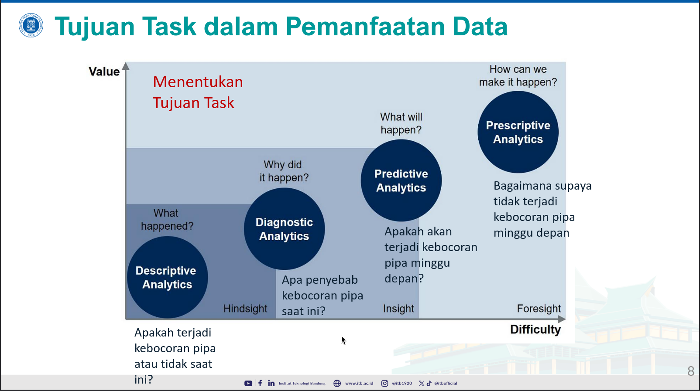

### Pengantar Regresi Linier

Example:  
Agen ditugasi menjual rumah, no knowledge of the price
ightarrow lakukan inferensi, perbandingan antara harga rumah sekitar dengan jml kamar (or any factors yang membuat harga rumah mungkin naik)
ightarrow mendapat perkiraan harga rumah berdasarkan jml kamar  
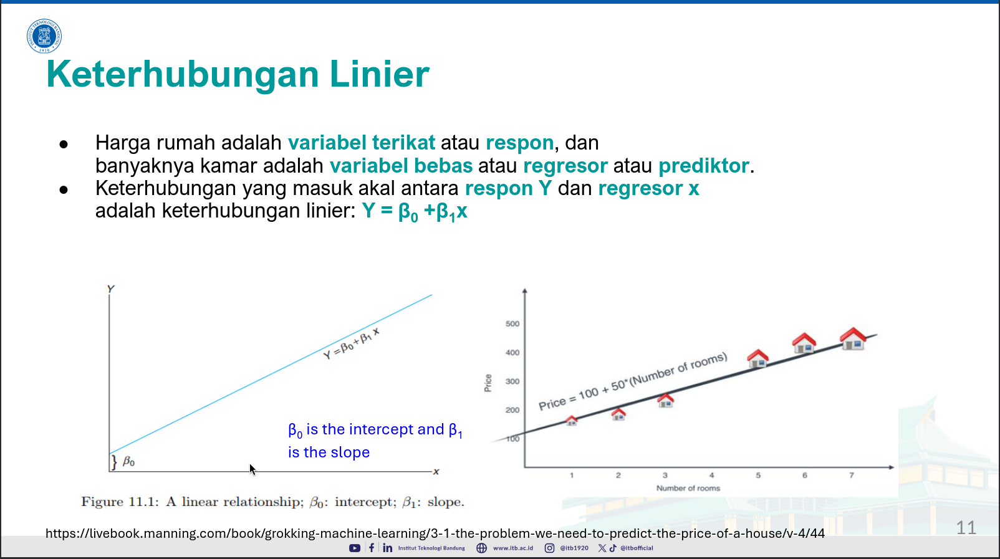

Prediksi Respon Y berdasarkan Regresor X  
**Response** Y (harga rumah) berdasarkan **Regressor** (banyaknya kamar)

Pemodelan Regresi dalam Python  
Read more [here](https://realpython.com/linear-regression-in-python/)  
Or watch [here](https://www.youtube.com/watch?v=4hUHwfSHJ7E)

## Meet 7 Part 2 Machine Learning

// Sir the second meet has hit the towers

Topics:

1. Tiga Jenis Machine Learning:

- Supervised Learning
- Unsupervised Learning
- Reinforcement Learning

### Machine Learning

What is it?  
Machine learning ⊂ (subset) Artificial Intelligence

- Kelleher et al. (2015):
  Machine Learning: proses otomatis meng**ekstraksi pola** dari data
- Arthur Samuel (1959):
  Machine Learning: Bidang ilmu yg memberikan komputer kemampuan **belajar dari data _tanpa_ diprogram** secara eksplisit

Contoh Pola Data  
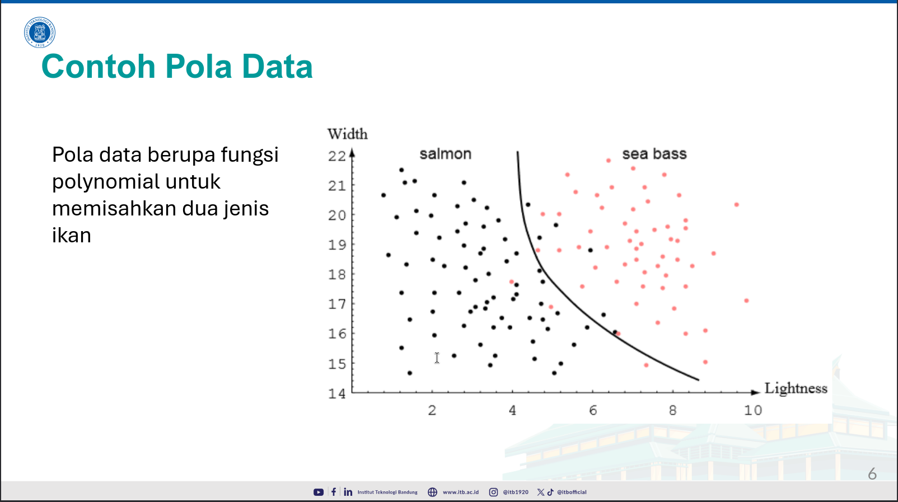

#### Mengapa Machine Learning?

- Better Algorithm
  Lebih efektif & efisien, banyak library, no code tools
- More Data
  Data lebih mudah didapatkan (Large Storage, IoT)
- More Processing Power
  Mesin komputasi yg lbh baik (GPU, TPU, prosesor ANN)

#### Supervised Learning

Diberikan training data \<input-output> pairs, mencari **suatu fungsi** yg memetakan **input ke output**  
Regresi:

ightarrow Utk menemukan **relasi** terbaik antara variabel _terikat_ Y dgn satu/lbh variabel _bebas_ X

ightarrow Model regresi digunakan utk memprediksi nilai Y berdasarkan nilai X

Supervised Learning utk Klasifikasi  
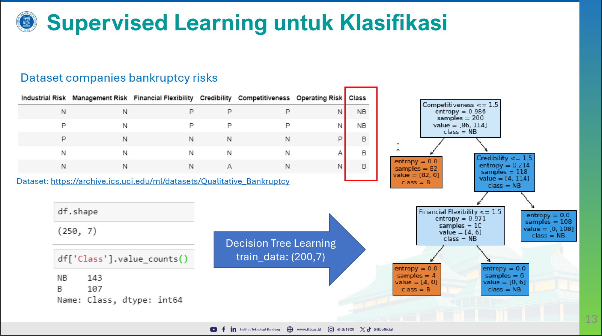

Klasifikasi Gambar dgn Deep Learning  
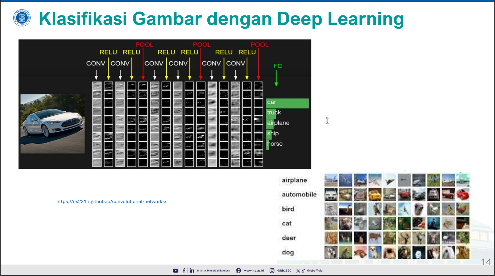

Modelling w/ Supervised Learning  
Training Data
ightarrow Preprocessing & Feature Extraction
ightarrow Kategori
ightarrow Machine Learning
ightarrow model

#### Unsupervised Learning

ightarrow Diberikan training data **tanpa label**, mencari pola data yg berguna

ightarrow Task _cluttering_ berdasarkan kedekatan data

Mining Frequent Patterns

ightarrow Mencari pola kemunculan, seperti **market-basket analysis** utk mendapatkan aturan _asosiasi_  
[Reg](https://github.com/clone95/Market-Basket-Analysis)

Perbedaan dgn Supervised

ightarrow Supervised basically ngasih label2 dan training until outputs correct

ightarrow Unsupervised basically give nothing but can label based on pattern recognition

#### Reinforcement Learning

i.e Taxi Driver Agent

ightarrow Agent learns from reinforcements containing either rewards/punishments

ightarrow Agent takes action based on rewards/punishments they'll receive

### Conclusion

1. Unsupervised Learning (no feedback)
   Diberikan sekumpulan data _tanpa label_, deteksi/menentukan pengelompokan cukup dari data. i.e good/bad traffic day recognition
2. Supervised Learning
   Diberikan sekumpulan data berupa **input dan output** (label), dipelajari suatu fungsi yg memetakan input ke output. i.e brake decision
3. Reinforcement Learning
   Agent belajar dari serangkaian observasi yg memberikan nilai _reward_ atau _punishment_, agent kemudian menghasilkan aksi apa yang memberikan reward terbaik dalam suatu kondisi.

## Done

aight kthx bye
